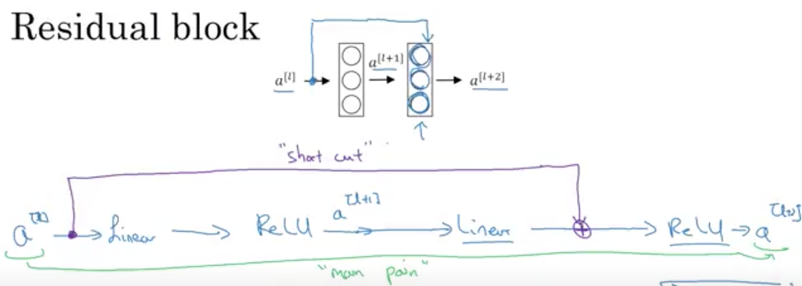

# Convolutional Neural Networks

## CNN \(Convolutional Neural Networks\)

Why need convolutional layer

fully connected deep network require a huge number of parameters

don't capture the natrual invariance we expected in images \(location, scale\). In many problems, location of pattern is not important, only presence of pattern matters. Therefore, we need to scan for patterns.

Convolutional layer

Output size = \[\(N-M\)/S\] + 1, image size: N\*M, filter: M\*M, stride: S Also common to use 3D convolutions to combine multiple channels still linear layer

Poolling layer: max pooling, mean pooling

### !!!!!! IMPORTANT TO UNDERSTAND CNN IN WHOLE: Objective of Convolutional layer

[Example of Popular CNN Architectures, refer to _Classic Network_ section](https://www.analyticsvidhya.com/blog/2018/12/guide-convolutional-neural-network-cnn/)

**Conv layer keep the dimension of input image or prior layer data \(extract features/generate feature maps or filters\), while pooling layer decrease the data dimension exponentially \(extract more important feature\)**

### Architecture to get high accuracy results from popular networks

**Note:** Regarding choose number of pairs of convS-pooling, refer to section _!!!!!! CNN Architecture for MNIST_; _**Conv layer can be followed by BN as well.**_

**CODE EXAMPLES:**

kernal = filter = conv

Pytorch example: self.conv1 = nn.Conv2d\(3, 6, 5\)  
 \#in\_channels = 3 RGB the input channels of prior layer or input image  
 \#out\_channels = 16 the number of filters  
 \#kernel\_size = 5 the convolutional kernel/filter sizes  
 \#Finally, **we will input 3 channels RGB image and produce 16 filters of \(5,5\) kernal size**  

[Keras Function Input Explaination](https://stackoverflow.com/questions/44747343/keras-input-explanation-input-shape-units-batch-size-dim-etc)

**Initialising the CNN**

classifier = Sequential\(\)

**Step 1 - Convolution \(two covolutional layers\) \#Conv layer can be followed by BN as well.**

input\_size = \(128, 128\)  
 classifier.add\(Conv2D\(32, \(3, 3\), input\_shape=\(\*input\_size, 3\)\)\)  
 classifier.add\(Activation\("relu"\)\)  
 classifier.add\(Conv2D\(32, \(3, 3\), activation = "relu"\)\)  

**Step 2 - Pooling**

classifier.add\(MaxPooling2D\(pool\_size=\(2, 2\)\)\) \# 2x2 is optimal  
 classifier.add\(BatchNormalization\(\)\)  
 classifier.add\(Dropout\(0.2\)\)  

**Adding a second convolutional\(two\)-pooling pair of layers \#Conv layer can be followed by BN as well.**

classifier.add\(Conv2D\(32, \(3, 3\)\)\) classifier.add\(Activation\("relu"\)\)  
 classifier.add\(Conv2D\(32, \(3, 3\), activation = "relu"\)\)  
 classifier.add\(MaxPooling2D\(pool\_size=\(2, 2\)\)\)  
 classifier.add\(BatchNormalization\(\)\)  
 classifier.add\(Dropout\(0.2\)\)  

**Adding a third convolutional\(three\)-pooling pair of layers \#Conv layer can be followed by BN as well.**

classifier.add\(Conv2D\(64, \(3, 3\)\)\) classifier.add\(Activation\("relu"\)\)  
 classifier.add\(Conv2D\(64, \(3, 3\), activation = "relu"\)\)  
 classifier.add\(Conv2D\(64, \(3, 3\), activation = "relu"\)\)  
 classifier.add\(MaxPooling2D\(pool\_size=\(2, 2\)\)\)  
 classifier.add\(BatchNormalization\(\)\)  
 classifier.add\(Dropout\(0.2\)\)  

**Step 3 - Flattening**

classifier.add\(Flatten\(\)\)

**Step 4 - Full connection**

classifier.add\(Dense\(units=64, activation='relu'\)\) classifier.add\(Dropout\(0.2\)\)  
 classifier.add\(Dense\(units=1, activation='sigmoid'\)\)

**Compiling the CNN**

classifier.compile\(optimizer='adam', loss='binary\_crossentropy', metrics=\['accuracy'\]\)

Example: 

Input Image -&gt; Feature Detector \(Kernel or Filter\) = **Feature Map** \(how many pixels of Input pixels match Feature Detector matrix\) \(make the image smaller\) \(lose information but force on important features to us\) \(dimentions same as input image or prior layer\)

### Feature Detector/ Filter

Convolutional Neural Networks are \(usually\) supervised methods for image/object recognition. This means that you need to train the CNN using a set of labelled images: this allows to optimize the weights of its convolutional filters, hence learning the filters shape themselsves, to minimize the error.

Once you have decided the size of the filters, as much as the initialization of the filters is important to "guide" the learning, you can indeed initialize them to random values, and let the learning do the work.

Convoluntional layer: Extract features from input image or prior layers

refer here [https://github.com/Adrian107/Interview-Preparation/blob/master/pics/convLayer.gif](https://github.com/Adrian107/Interview-Preparation/blob/master/pics/convLayer.gif)

#### 

#### ReLU Layer, remove negative value of image

\*\*\*\*

\*\*\*\*

**Pooling vs Convolutional layer:**

Pooling: use statistical methods, such as max pooling and average pooling

Convolutional layer: use different feature detector 

### Max Pooling/ Max Subsampling

**Feature Maps** -&gt; Extract the max value in the box \(2X2 stride\) -&gt; **Pooled Feature Map**

1. Preserve the information but get rid of large portion of features, which are not important
2. Redure number of parameter of the finals in neural network
3. Avoid overfitting, disregarding the unnecessary information

Pooling layer: This is to **decrease the computational power** required to process the data through dimensionality reduction. Furthermore, it is useful for **extracting dominant features** which are rotational and positional invariant, thus maintaining the process of effectively training of the model.

refer here [https://github.com/Adrian107/Interview-Preparation/blob/master/pics/pooling.gif](https://github.com/Adrian107/Interview-Preparation/blob/master/pics/pooling.gif)

### Sub-sampling/ Average pooling

**Feature Maps** -&gt; Extract the average value in the box \(2X2 stride\) -&gt; **Pooled Feature Map**

### Flattening

**Pooled Feature Map** -&gt; Flattening, row by row -&gt; long column -&gt; neural nets

Overall Procedure:

### Full Connection

### Softmax & Cross-Entropy

**softmax** 把分类输出标准化成概率分布，**cross-entropy** 刻画预测分类和真实结果之间的相似度。

Cross-Entropy: cost function for classification, CNN MSE: Regression Why Cross-Entropy in classification:

When you **derive the cost function** from the aspect of probability and distribution, you can observe that **MSE happens when you assume the error follows Normal Distribution** and **cross-entropy when you assume binomial distribution**. It means that implicitly when you use **MSE, you are doing regression** \(estimation\) and when you use **CE, you are doing classification**.

Let's say your outcome that you want is one and right now you are at one millionth of one, right?

0.000001.

And then, next time you improve your outcome _**from one millionth to one thousandth** and in terms of, if you calculate the squared error, you're just subtracting one from the other, or basically in each case you're calculating the squared error and you'll see that the **squared error**_ is when you compare one case versus the other, it **didn't change that much**. You didn't improve your network that much when you're looking at the mean squared error. But if you're looking at the **cross-entropy, because you're taking a logarithm,** and then you're **comparing the two, dividing one with the other**, you will see that you have actually **improved your network significantly**. So that jump from one millionth to one thousandth in mean squared error terms will be very low. It will be insignificant and it won't guide your gradient boosting process or your back propagation in the right direction. It will guide it in the right direction but it will be like a very slow guidance, it won't have enough power, whereas if you do through **cross-entropy**, cross-entropy will understand that, oh **even though these are very small adjustments that are just, you know, making a tiny change in absolute terms, in relative terms, it's a huge improvement, and we're definitely going in the right direction**, let's keep going that way.

#### Practical Notes

Use ImageDataGenerator\(\) from Keras when there are not much images. _It will create many batches of our images, and in each batch it will apply some random transformations on a random selection of our images, like rotating them, flipping them, shifting them, or even shearing them, and eventually what we'll get during the training is many more diverse images inside these batches, and therefore a lot more material to train._

Because the transformations are random transformations, well our model will never find the same picture across the batches. So **all this image augmentation trick can only reduce overfitting.**

In summary, _**image augmentation is a technique that allows us to enrich our data set, our data set, without adding more images and therefore that allows us to get good performance results with little or no overfitting, even with a small amount of images.**_

#### Improve the model

1. Add a convolutional layer \(will extract more features, but too many convolutional layers will cause overfitting, ex: [Suppose we train a model for detecting cats. If all cats features are detected and we add more layers, it can start detecting the bell the cat is wearing as a part of the cat. It may end up classifying a cat without bell as not cat and may sometimes classify another animal with bell as cat. This is because adding more layers beyond a certain threshold leads to finding irregularities in the data](https://www.quora.com/Does-adding-more-layers-always-result-in-more-accuracy-in-convolutional-neural-networks)\) OR
2. Add a fully connected layer

### !!!!!! CNN Architecture for MNIST

[Kaggle Experiment](https://www.kaggle.com/cdeotte/how-to-choose-cnn-architecture-mnist)

1. **How many convolution-pooling pairs? \(choose number of convolutional-pooling layers\)** **Pooling will decrease dimensions of your data exponentially. And so even if you have an image of size 256 x 256, you only get maybe 5 pools before you lose too much information \(and therefore 5 convolutions\) \(256/\(2^5\)=8\)** input image = 28x28, after one pair, it's 14x14. After two, it's 7x7. After three it's 4x4 \(or 3x3 if we don't use padding='same'\). It doesn't make sense to do a fourth convolution. TWO if computational cost matters, otherwise 3. NOTE: Conv2D\(\): filters number is double in each sequential layer, ex: **It's typical to increase the number of feature maps for each subsequent pair as shown here.** nets = 3 model = \[0\] \*nets

for j in range\(3\):  
 model\[j\] = Sequential\(\)  
 model\[j\].add\(Conv2D\(**24**,kernel\_size=5,padding='same',activation='relu', input\_shape=\(28,28,1\)\)\)  
 model\[j\].add\(MaxPool2D\(\)\)  
 if j&gt;0:  
 model\[j\].add\(Conv2D\(**48**,kernel\_size=5,padding='same',activation='relu'\)\)  
 model\[j\].add\(MaxPool2D\(\)\)  
 if j&gt;1:  
 model\[j\].add\(Conv2D\(**64**,kernel\_size=5,padding='same',activation='relu'\)\)  
 model\[j\].add\(MaxPool2D\(padding='same'\)\)  
 model\[j\].add\(Flatten\(\)\)  
 model\[j\].add\(Dense\(256, activation='relu'\)\)  
 model\[j\].add\(Dense\(10, activation='softmax'\)\)  
 model\[j\].compile\(optimizer="adam", loss="categorical\_crossentropy", metrics=\["accuracy"\]\)

Another layers number choice example: if input image is 64x64: one pair: 32x32 two pair: 16x16 three pair: 8x8 four pair: 4x4  
 so the filters number should be increased in each sequential layers. such as 24, 48 64, 128. Hence, 3 or 4 layers

1. **How many feature maps?** It appears that **32 maps in the first convolutional layer** and **64 maps in the second convolutional layer** is the best. Architectures with more maps only perform **slightly better** and are not worth the additonal computation cost.
2. **How large a dense layer?** It appears that **128 units is the best**. Dense layers with more units only perform **slightly better** and are not worth the additional computational cost. \(I also tested **using two consecutive dense layers** instead of one, but that showed **no benefit over a single dense layer**.\)
3. **How much dropout?** From the experiment, **40%\(30%-50%\)** is the best.
4. **Kernal size** Instead of using one convolution layer of size 5x5, you can mimic 5x5 by using two consecutive 3x3 layers and it will be more nonlinear.
5. **Stride** \(Stride is the number of pixels shifts over the input matrix. When the stride is 1 then we move the filters to 1 pixel at a time. When the stride is 2 then we move the filters to 2 pixels at a time and so on\) Instead of using a max pooling layer, you can pool by using a convolution layer with strides=2 and it will be learnable
6. What is the **benefit of using two consecutive convolutional layers then a pool layer instead of a conv pool**?

**Pooling decreases the dimensions of your data exponentially**. And so even if you have an image of size 256 x 256, you only get maybe 5 pools before you **lose too much information** \(and therefore 5 convolutions\). As a result, we would typically like to have multiple conv layers before a pool, so that we can build up **better representations of the data without quickly losing all of your spatial information**.

In fact, we often don't even use two convolutions per pool, in many of the modern large image classifican networks, like VGG, Inception and ResNet, you can often see 5–30 conv layers at a time before pooling!

1. **Batch normalization** HELPS!
2. **Data augumentation** HELPS! \(ImageDataGenerator\(\) from Keras\)

#### Batch Normalization

**Why do we use batch normalization?**

**We normalize the input layer by adjusting and scaling the activations**. For example, when we have features from 0 to 1 and some from 1 to 1000, we should normalize them to **speed up learning**. If the input layer is benefiting from it, why not do the same thing also for the values in the hidden layers, that are changing all the time, and get 10 times or more improvement in the training speed. Batch normalization **reduces the amount by what the hidden unit values shift around \(covariance shift\)**. To explain covariance shift, let’s have a deep network on cat detection. We train our data on only black cats’ images. So, if we now try to apply this network to data with colored cats, it is obvious; we’re not going to do well. The training set and the prediction set are both cats’ images but they differ a little bit. In other words, if an algorithm learned some X to Y mapping, and if the distribution of X changes, then we might need to retrain the learning algorithm by trying to align the distribution of X with the distribution of Y. Also, batch normalization **allows each layer of a network to learn by itself a little bit more independently of other layers.**

**Why Does Batch Norm Work?**

We can use higher learning rates because batch normalization **makes sure that there’s no activation that’s gone really high or really low.** And by that, things that previously couldn’t get to train, it will start to train. It **reduces overfitting because it has a slight regularization effects. Similar to Dropout, it adds some noise to each hidden layer’s activations**. Therefore, **if we use batch normalization, we will use less dropout**, which is a good thing because we are not going to lose a lot of information. However, we **should not depend only on batch normalization for regularization**; we should better use it together with dropout.

**How does batch normalization work?**

To increase the stability of a neural network, batch normalization normalizes the output of a previous activation layer by **subtracting the batch mean and dividing by the batch standard deviation.** However, **after this shift/scale of activation outputs** by some randomly initialized parameters, the **weights in the next layer are no longer optimal**. **SGD \( Stochastic gradient descent\) undoes this normalization** if it’s a way for it to minimize the loss function. Consequently, batch normalization adds two trainable parameters to each layer, so the _normalized output is multiplied by a “standard deviation” parameter \(gamma\) and add a “mean” parameter \(beta\)._ In other words, _batch normalization lets SGD do the **denormalization** by changing only these two weights for each activation, instead of losing the stability of the network by changing all the weights._

**Batch normalization and pre-trained networks like VGG:**

VGG doesn’t have a batch norm layer in it because batch normalization didn’t exist before VGG. If we train it with it from the start, the pre-trained weight will benefit from the normalization of the activations. So adding a batch norm layer actually improves ImageNet, which is cool. You can add it to dense layers, and also to convolutional layers. **If we insert a batch norm in a pre-trained network, it will change the pre-trained weights, because it will subtract the mean and divide by the standard deviation for the activation layers and we don’t want that to happen because we need those pre-trained weights to stay the same. So, what we need to do is to insert a batch norm layer and figure out gamma and beta in order to undo the outputs change.** To summarize everything, you can think about batch normalization as doing preprocessing at every layer of the network.

#### Batch size; Epoch; Iterations

[Detailed Explainations; Ad](https://stats.stackexchange.com/q/153535)

In short, **The batch size defines the number of samples that will be propagated through the network.**

**Advantages of using a batch size &lt; number of all samples:**

It requires less memory. Since you train the network using fewer samples, the overall training procedure requires less memory. That's especially important if you are not able to fit the whole dataset in your machine's memory.

Typically networks train faster with mini-batches. That's because we update the weights after each propagation. In our example we've propagated 11 batches \(10 of them had 100 samples and 1 had 50 samples\) and after each of them we've updated our network's parameters. If we used all samples during propagation we would make only 1 update for the network's parameter.

**Disadvantages of using a batch size &lt; number of all samples:**

The smaller the batch the less accurate the estimate of the gradient will be. In the figure below, you can see that the direction of the mini-batch gradient \(green color\) fluctuates much more in comparison to the direction of the full batch gradient \(blue color\)

**batch size** = the number of training examples in one forward/backward pass. The higher the batch size, the more memory space you'll need. **one epoch** = one forward pass and one backward pass of all the training examples

**number of iterations** = number of passes, each pass using \[batch size\] number of examples. To be clear, one pass = one forward pass + one backward pass \(we do not count the forward pass and backward pass as two different passes\)..

#### Padding

**Summary:**

padding是增加各个边的pixels的数量，目的是保持feature map 不要太小，但也没必要超过原图的大小，所以不可以任意数量； padding的上限是维持feature map 大小与原图大小一致，具体增加pixel的数量多少，由filter的尺寸和stride大小共同决定； 有一个具体的算法，实现padding, filter size, feature map size之间的相互推导计算。

**padding 存在的意义在于**

为了不丢弃原图信息 为了保持feature map 的大小与原图一致 为了让更深层的layer的input依旧保持有足够大的信息量 为了实现上述目的，且不做多余的事情，padding出来的pixel的值都是0，不存在噪音问题。

## Inception

Motivation: **Eliminate the influence of size on the recognition result**, use multiple different filter sizes at once to capture multiple concepts with different ranges, and **let the network choose the required features by itself**

### 1x1 Conv

Linearly transformation in the different channels to adjust their dimension

